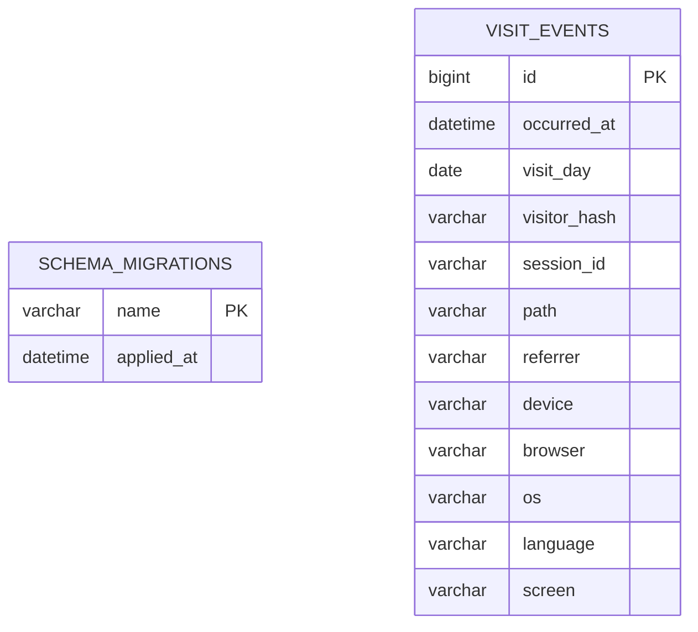

# 童趣成长乐园数据库表结构

## 文档用途

本文档是项目的数据库字典，记录所有 MySQL 表、字段、索引、表关系和数据生命周期。当前数据库基于 MySQL 8.0，使用 `mysql2` 和原生 SQL 迁移，不使用 ORM。

- 数据库名：本地默认 `playmori`，正式环境由 `.env` 决定
- 字符集：`utf8mb4`
- 排序规则：`utf8mb4_unicode_ci`
- 存储引擎：InnoDB
- 时间标准：所有 `DATETIME` 按 UTC 写入和读取
- 结构事实来源：`database/migrations/` 和 `server/db/migrate.mjs`
- 文档最后核对：2026-07-16

> 数据库迁移是可执行的事实来源，本文档是供开发和评审使用的结构说明。新增或修改表结构时，迁移文件和本文档必须在同一次提交中更新。

## 表清单

| 表名 | 类型 | 用途 | 主要数据来源 | 保留规则 |
| --- | --- | --- | --- | --- |
| `schema_migrations` | 系统表 | 记录已经执行过的 SQL 迁移，避免重复执行 | `npm run db:migrate` | 永久保留 |
| `visit_events` | 业务表 | 保存成人访客明确同意后的去标识化访问事件 | `/api/analytics/visit` | 默认保留 30 天 |

## 当前表关系

当前两张表之间没有外键或业务关联：

- `schema_migrations` 只管理数据库结构版本，不参与业务查询。
- `schema_migrations.name` 在逻辑上对应 `database/migrations/` 中的迁移文件名，但这不是数据库外键。
- `visit_events` 当前是独立事件表，不关联儿童、家长、账号或故事数据。

## `schema_migrations`

### 用途

记录迁移文件是否已经执行。该表由 `server/db/migrate.mjs` 自动创建和维护，不应由业务代码写入。

### 字段

| 字段名 | 类型 | 可空 | 默认值 | 键/索引 | 描述 |
| --- | --- | --- | --- | --- | --- |
| `name` | `VARCHAR(191)` | 否 | 无 | 主键 | 已执行的迁移文件名，例如 `001_create_visit_events.sql` |
| `applied_at` | `DATETIME(3)` | 否 | `CURRENT_TIMESTAMP(3)` | 无 | 迁移成功记录的时间，精确到毫秒 |

### 约束与关系

- 主键：`name`
- 外键：无
- 业务表关系：无
- 代码入口：`server/db/migrate.mjs`

## `visit_events`

### 用途

保存经过访客同意、服务端去标识化后的页面访问事件，用于统计访问量、热门页面和设备适配情况。不用于广告、儿童画像或跨日追踪个人。

### 字段

| 字段名 | 类型 | 可空 | 默认值 | 键/索引 | 描述 |
| --- | --- | --- | --- | --- | --- |
| `id` | `BIGINT UNSIGNED` | 否 | 自增 | 主键 | 访问事件唯一编号 |
| `occurred_at` | `DATETIME(3)` | 否 | 无 | `idx_visit_events_occurred_at`、`idx_visit_events_path_time` | 事件发生时间，按 UTC 保存，精确到毫秒 |
| `visit_day` | `DATE` | 否 | 无 | `idx_visit_events_visitor_day` | UTC 日期，用于生成和查询每日访客标识 |
| `visitor_hash` | `VARCHAR(20)` | 否 | 无 | `idx_visit_events_visitor_day` | 原始 IP 经服务端 HMAC-SHA256 处理后截取的每日标识；不保存原始 IP，每天都会变化 |
| `session_id` | `VARCHAR(64)` | 否 | 无 | 无 | 当前浏览器标签页生成的随机会话编号，不代表账号或儿童身份 |
| `path` | `VARCHAR(240)` | 否 | 无 | `idx_visit_events_path_time` | 访问页面路径；查询参数会被移除 |
| `referrer` | `VARCHAR(120)` | 否 | 无 | 无 | 来源网站域名；直接访问记录为 `direct`，不保存完整来源地址 |
| `device` | `VARCHAR(16)` | 否 | 无 | 无 | 设备大类：`desktop`、`tablet` 或 `mobile` |
| `browser` | `VARCHAR(20)` | 否 | 无 | 无 | 浏览器大类，如 `Chrome`、`Safari`、`Firefox`、`Edge` 或 `Other` |
| `os` | `VARCHAR(20)` | 否 | 无 | 无 | 操作系统大类，如 `iOS`、`Android`、`Windows`、`macOS`、`Linux` 或 `Other` |
| `language` | `VARCHAR(20)` | 否 | 无 | 无 | 浏览器语言，例如 `zh-CN` |
| `screen` | `VARCHAR(12)` | 否 | 无 | 无 | 屏幕宽度分组：`small`、`medium`、`large` 或 `unknown` |

### 索引

| 索引名 | 字段 | 用途 |
| --- | --- | --- |
| `PRIMARY` | `id` | 唯一定位访问事件 |
| `idx_visit_events_occurred_at` | `occurred_at` | 按时间范围生成报表和清理过期数据 |
| `idx_visit_events_path_time` | `path`, `occurred_at` | 查询某个页面在指定时间段内的访问情况 |
| `idx_visit_events_visitor_day` | `visitor_hash`, `visit_day` | 统计每日去重访客 |

### 约束、关系与生命周期

- 外键：无
- 当前业务表关系：无
- 写入入口：`server/analytics.mjs` → `server/database.mjs`
- 查询入口：`server/analytics-report.mjs`
- 清理入口：服务启动时调用 `deleteExpiredVisits`
- 保留期限：由 `ANALYTICS_RETENTION_DAYS` 控制，默认 30 天
- 降级机制：MySQL 写入失败时写入服务器本地 JSONL，数据库恢复后不影响网站访问

## 表结构维护规范

以后增加或修改任何表结构，都必须同时完成以下事项：

1. 在 `database/migrations/` 新增按顺序编号的 SQL 文件，例如 `002_create_stories.sql`；已经执行过的迁移文件不得直接修改。
2. 在本文档的“表清单”中增加或更新对应表。
3. 补齐字段、主键、唯一约束、普通索引、外键、数据来源和保留规则。
4. 更新 Mermaid 关系图；有关联时明确标注一对一、一对多或多对多。
5. 如果使用外键，关联字段统一使用 `<实体>_id`，字段类型必须与被引用主键完全一致，并为关联字段建立索引。
6. 表名和字段名使用小写 `snake_case`；业务表优先使用复数表名。
7. 自增主键默认使用 `BIGINT UNSIGNED`；时间字段使用 `DATETIME(3)` 并按 UTC 处理。
8. 明确数据是否包含个人信息、保留多久、如何删除，不得在数据库或文档中保存密钥和明文密码。
9. 执行 `npm run db:migrate`、`npm run db:check` 和 `npm test`，确认成功后再提交。
10. 同步更新个人知识库中的 `儿童成长乐园/02-技术/数据库表结构.md`。

## 变更记录

| 日期 | 迁移 | 变更 |
| --- | --- | --- |
| 2026-07-16 | 迁移脚本自动创建 | 新增 `schema_migrations` 迁移记录表 |
| 2026-07-16 | `001_create_visit_events.sql` | 新增 `visit_events` 去标识化访客事件表及三个查询索引 |
