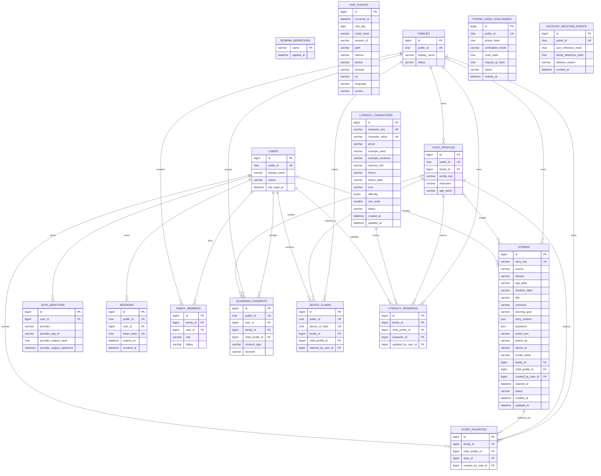

# 童趣成长乐园数据库表结构

## 文档用途

本文档是项目的数据库字典，记录所有 MySQL 表、字段、索引、表关系和数据生命周期。当前数据库基于 MySQL 8.0，使用 `mysql2` 和原生 SQL 迁移，不使用 ORM。

- 数据库名：本地默认 `playmori`，正式环境由 `.env` 决定
- 字符集：`utf8mb4`
- 排序规则：`utf8mb4_unicode_ci`
- 存储引擎：InnoDB
- 时间标准：所有 `DATETIME` 按 UTC 写入和读取
- 结构事实来源：`database/migrations/` 和 `server/db/migrate.mjs`
- 文档最后核对：2026-07-21

> 数据库迁移是可执行的事实来源，本文档是供开发和评审使用的结构说明。新增或修改表结构时，迁移文件和本文档必须在同一次提交中更新。

## 表清单

| 表名 | 类型 | 用途 | 主要数据来源 | 保留规则 |
| --- | --- | --- | --- | --- |
| `schema_migrations` | 系统表 | 记录已经执行过的 SQL 迁移，避免重复执行 | `npm run db:migrate` | 永久保留 |
| `visit_events` | 业务表 | 保存成人访客明确同意后的去标识化访问事件 | `/api/analytics/visit` | 默认保留 30 天 |
| `stories` | 业务表 | 统一保存系统预设故事和 AI 生成故事 | 预设故事同步、`/api/stories/generate` | 预设故事永久保留；AI 故事可由所属设备或家庭删除 |
| `literacy_characters` | 业务表 | 保存汉字小森林的识字内容 | 识字内容同步 | 永久保留 |
| `users` | 账号表 | 保存不依赖具体登录渠道的用户主体 | 首次正式登录 | 账号存续期间保留；自助注销时删除 |
| `auth_identities` | 账号表 | 保存手机号、微信等外部登录身份与用户的绑定关系 | 登录渠道验证成功后绑定 | 身份解绑或账号注销时删除 |
| `sessions` | 安全表 | 保存网站登录会话的令牌摘要和有效期 | 登录成功 | 到期或撤销后可定期清理 |
| `families` | 家庭表 | 保存家庭空间，作为儿童档案和未来权益的归属边界 | 首次创建账号 | 家庭存续期间保留 |
| `family_members` | 家庭表 | 保存用户与家庭的成员关系和角色 | 创建家庭、邀请成员 | 退出家庭或账号注销后删除/失效 |
| `child_profiles` | 儿童档案表 | 保存家庭内最小化的儿童档案 | 创建家庭时自动生成默认档案 | 默认档案不可删除，可清空；其他档案可软删除 |
| `guardian_consents` | 合规表 | 保存监护人对协议、隐私和儿童数据处理的版本化决定 | 用户确认相关协议 | 作为审计记录长期保留 |
| `device_claims` | 同步表 | 记录浏览器设备已归属的家庭及首次同步数量 | 成人登录后明确确认同步 | 家庭存续期间保留；设备标识只保存 HMAC 摘要 |
| `story_favorites` | 成长数据表 | 保存儿童档案的故事收藏 | 设备数据同步、登录后收藏操作 | 随家庭、儿童档案或故事删除而删除 |
| `literacy_progress` | 成长数据表 | 保存儿童档案的识字进度 | 设备数据同步、登录后学习操作 | 随家庭、儿童档案或识字内容删除而删除 |
| `phone_login_challenges` | 安全表 | 保存手机号验证码挑战及限流审计数据 | `/api/auth/phone/request-code` | 默认 30 天后自动清理；不保存明文手机号或验证码 |
| `account_deletion_events` | 审计表 | 保存账号注销完成的去标识化证明 | 用户自助注销 | 不保存手机号、用户 ID 或家庭 ID；按审计策略保留 |

## 当前表关系

账号、家庭、故事和学习数据通过外键建立关系；系统与统计数据仍保持清晰边界：

- `schema_migrations` 只管理数据库结构版本，不参与业务查询。
- `schema_migrations.name` 在逻辑上对应 `database/migrations/` 中的迁移文件名，但这不是数据库外键。
- `visit_events` 当前是独立事件表，不关联儿童、家长、账号或故事数据。
- `stories.device_id` 是浏览器生成的随机设备标识，用于未登录状态下找回 AI 故事；成人确认同步后，通过 `family_id` 和 `child_profile_id` 归入家庭。
- `literacy_characters` 是独立的识字内容表；登录后的“我认识了”记录由 `literacy_progress` 关联儿童档案。
- `users` 是渠道无关的账号主体；手机号、公众号和未来小程序身份统一通过 `auth_identities` 绑定，不在 `users` 中直接保存手机号或微信标识。
- `families` 是数据和未来付费权益的归属边界，`family_members` 实现用户与家庭的多对多成员关系。
- 每个新家庭自动创建 `profile_key = 'default'` 的最小儿童档案；昵称、年龄段和头像均可留空。
- `guardian_consents` 只追加记录每次决定，不覆盖历史记录。
- `phone_login_challenges` 不与 `users` 建外键：验证码验证成功前尚不存在可信账号关系，手机号和请求 IP 仅保留 HMAC 摘要。

## `schema_migrations`

### 用途

记录迁移文件是否已经执行。该表由 `server/db/migrate.mjs` 自动创建和维护，不应由业务代码写入。

### 字段

| 字段名 | 类型 | 可空 | 默认值 | 键/索引 | 描述 |
| --- | --- | --- | --- | --- | --- |
| `name` | `VARCHAR(191)` | 否 | 无 | 主键 | 已执行的迁移文件名，例如 `001_create_visit_events.sql` |
| `applied_at` | `DATETIME(3)` | 否 | `CURRENT_TIMESTAMP(3)` | 无 | 迁移成功记录的时间，精确到毫秒 |

### 约束与关系

- 主键：`name`
- 外键：无
- 业务表关系：无
- 代码入口：`server/db/migrate.mjs`

## `visit_events`

### 用途

保存经过访客同意、服务端去标识化后的页面访问事件，用于统计访问量、热门页面和设备适配情况。不用于广告、儿童画像或跨日追踪个人。

### 字段

| 字段名 | 类型 | 可空 | 默认值 | 键/索引 | 描述 |
| --- | --- | --- | --- | --- | --- |
| `id` | `BIGINT UNSIGNED` | 否 | 自增 | 主键 | 访问事件唯一编号 |
| `occurred_at` | `DATETIME(3)` | 否 | 无 | `idx_visit_events_occurred_at`、`idx_visit_events_path_time` | 事件发生时间，按 UTC 保存，精确到毫秒 |
| `visit_day` | `DATE` | 否 | 无 | `idx_visit_events_visitor_day` | UTC 日期，用于生成和查询每日访客标识 |
| `visitor_hash` | `VARCHAR(20)` | 否 | 无 | `idx_visit_events_visitor_day` | 原始 IP 经服务端 HMAC-SHA256 处理后截取的每日标识；不保存原始 IP，每天都会变化 |
| `session_id` | `VARCHAR(64)` | 否 | 无 | 无 | 当前浏览器标签页生成的随机会话编号，不代表账号或儿童身份 |
| `path` | `VARCHAR(240)` | 否 | 无 | `idx_visit_events_path_time` | 访问页面路径；查询参数会被移除 |
| `referrer` | `VARCHAR(120)` | 否 | 无 | 无 | 来源网站域名；直接访问记录为 `direct`，不保存完整来源地址 |
| `device` | `VARCHAR(16)` | 否 | 无 | 无 | 设备大类：`desktop`、`tablet` 或 `mobile` |
| `browser` | `VARCHAR(20)` | 否 | 无 | 无 | 浏览器大类，如 `Chrome`、`Safari`、`Firefox`、`Edge` 或 `Other` |
| `os` | `VARCHAR(20)` | 否 | 无 | 无 | 操作系统大类，如 `iOS`、`Android`、`Windows`、`macOS`、`Linux` 或 `Other` |
| `language` | `VARCHAR(20)` | 否 | 无 | 无 | 浏览器语言，例如 `zh-CN` |
| `screen` | `VARCHAR(12)` | 否 | 无 | 无 | 屏幕宽度分组：`small`、`medium`、`large` 或 `unknown` |

### 索引

| 索引名 | 字段 | 用途 |
| --- | --- | --- |
| `PRIMARY` | `id` | 唯一定位访问事件 |
| `idx_visit_events_occurred_at` | `occurred_at` | 按时间范围生成报表和清理过期数据 |
| `idx_visit_events_path_time` | `path`, `occurred_at` | 查询某个页面在指定时间段内的访问情况 |
| `idx_visit_events_visitor_day` | `visitor_hash`, `visit_day` | 统计每日去重访客 |

### 约束、关系与生命周期

- 外键：无
- 当前业务表关系：无
- 写入入口：`server/analytics.mjs` → `server/database.mjs`
- 查询入口：`server/analytics-report.mjs`
- 清理入口：服务启动时调用 `deleteExpiredVisits`
- 保留期限：由 `ANALYTICS_RETENTION_DAYS` 控制，默认 30 天
- 降级机制：MySQL 写入失败时写入服务器本地 JSONL，数据库恢复后不影响网站访问

## `stories`

### 用途

统一保存系统预设故事和 AI 生成故事。两类故事共用相同的故事包结构，通过 `source` 区分：

- `fixed`：系统预设故事，当前五大领域各 5 篇，共 25 篇。
- `ai`：家长通过 DeepSeek 生成的个性故事。

### 字段

| 字段名 | 类型 | 可空 | 默认值 | 键/索引 | 描述 |
| --- | --- | --- | --- | --- | --- |
| `id` | `BIGINT UNSIGNED` | 否 | 自增 | 主键 | 数据库内部故事编号 |
| `story_key` | `VARCHAR(64)` | 否 | 无 | 唯一索引 `uk_stories_story_key` | 面向应用的稳定故事标识；预设故事使用可读标识，AI 故事使用 `ai-<UUID>` |
| `source` | `VARCHAR(16)` | 否 | 无 | `idx_stories_source_domain_status` | 故事来源：`fixed` 或 `ai` |
| `domain` | `VARCHAR(16)` | 否 | 无 | `idx_stories_source_domain_status` | 成长领域：`health`、`language`、`social`、`science` 或 `art` |
| `age_label` | `VARCHAR(20)` | 否 | 无 | 无 | 展示用年龄段，例如 `3～6岁`、`4～5岁` |
| `duration_label` | `VARCHAR(20)` | 否 | 无 | 无 | 展示用朗读时长，例如 `4分钟`、`约5分钟` |
| `title` | `VARCHAR(80)` | 否 | 无 | 无 | 故事标题 |
| `summary` | `VARCHAR(255)` | 否 | 无 | 无 | 故事简介 |
| `learning_goal` | `VARCHAR(255)` | 否 | 无 | 无 | 给成人看的单一成长目标 |
| `story_content` | `JSON` | 否 | 无 | 无 | 正文段落字符串数组 |
| `questions` | `JSON` | 否 | 无 | 无 | 两个亲子讨论问题组成的字符串数组 |
| `action_text` | `VARCHAR(500)` | 否 | 无 | 无 | 可以在现实生活中实践的小行动 |
| `parent_tip` | `VARCHAR(500)` | 否 | 无 | 无 | 给成人的引导提示 |
| `device_id` | `VARCHAR(64)` | 是 | `NULL` | `idx_stories_device_created` | 浏览器随机设备标识；预设故事为空，AI 故事用于当前设备历史查询和删除 |
| `model_name` | `VARCHAR(80)` | 是 | `NULL` | 无 | AI 故事使用的模型名；预设故事为空 |
| `family_id` | `BIGINT UNSIGNED` | 是 | `NULL` | 外键、`idx_stories_family_created` | 登录生成或确认同步后所属家庭；预设和未同步故事为空 |
| `child_profile_id` | `BIGINT UNSIGNED` | 是 | `NULL` | 外键、`idx_stories_child_created` | 所属儿童档案；儿童档案删除时置空 |
| `created_by_user_id` | `BIGINT UNSIGNED` | 是 | `NULL` | 外键 | 生成故事或确认同步的成人账号；账号删除时置空 |
| `claimed_at` | `DATETIME(3)` | 是 | `NULL` | 无 | 设备故事首次归入家庭的时间 |
| `status` | `VARCHAR(16)` | 否 | `active` | `idx_stories_source_domain_status` | 内容状态，当前使用 `active` |
| `created_at` | `DATETIME(3)` | 否 | `CURRENT_TIMESTAMP(3)` | `idx_stories_device_created` | 创建时间，按 UTC 保存 |
| `updated_at` | `DATETIME(3)` | 否 | 创建时为当前时间，更新时自动刷新 | 无 | 最近更新时间，按 UTC 保存 |

### 索引

| 索引名 | 字段 | 用途 |
| --- | --- | --- |
| `PRIMARY` | `id` | 唯一定位数据库记录 |
| `uk_stories_story_key` | `story_key` | 防止同一故事重复写入，并保持前端收藏标识稳定 |
| `idx_stories_source_domain_status` | `source`, `domain`, `status` | 按来源、成长领域和状态读取故事书架 |
| `idx_stories_device_created` | `device_id`, `created_at` | 按当前设备读取最近生成的 AI 故事 |
| `idx_stories_family_created` | `family_id`, `created_at` | 按家庭读取最近生成的 AI 故事 |
| `idx_stories_child_created` | `child_profile_id`, `created_at` | 按儿童档案读取故事 |

### 数据来源、关系与生命周期

- 预设故事源文件：`database/fixed-stories.mjs`。
- 预设故事同步：`npm run db:migrate` 会在结构迁移后执行 `server/db/seed-stories.mjs`，使用 `story_key` 幂等新增或更新 25 篇故事。
- 预设故事读取：`GET /api/stories/fixed`。
- AI 故事写入：`POST /api/stories/generate` 在 DeepSeek 返回完整故事后写入数据库，写入成功后才向前端返回。
- AI 历史读取：`GET /api/stories/history`，设备编号通过 `X-Device-ID` 请求头传递，避免出现在访问日志 URL 中。
- AI 历史删除：未登录时使用 `DELETE /api/stories/history`；登录后使用 `DELETE /api/me/stories` 删除当前家庭 AI 故事。
- 家长填写的原始事件、小名、偏好和氛围不写入 `stories`；生成结果本身可能包含家长要求使用的小名。
- 预设故事永久保留；AI 故事保留到所属设备或家庭主动清空为止。
- 外键：`family_id → families.id ON DELETE CASCADE`；`child_profile_id → child_profiles.id ON DELETE SET NULL`；`created_by_user_id → users.id ON DELETE SET NULL`。`device_id` 仍不是外键。

## `literacy_characters`

### 用途

保存汉字小森林的系统识字内容。首版包含自然、动物、身体、家人和大小方向五个主题，每个主题 6 个字，共 30 个汉字。

### 字段

| 字段名 | 类型 | 可空 | 默认值 | 键/索引 | 描述 |
| --- | --- | --- | --- | --- | --- |
| `id` | `BIGINT UNSIGNED` | 否 | 自增 | 主键 | 数据库内部识字内容编号 |
| `character_key` | `VARCHAR(64)` | 否 | 无 | 唯一索引 `uk_literacy_characters_key` | 内容稳定标识，例如 `nature-sun` |
| `character_value` | `VARCHAR(8)` | 否 | 无 | 唯一索引 `uk_literacy_characters_value` | 要学习的汉字，首版均为单字 |
| `pinyin` | `VARCHAR(32)` | 否 | 无 | 无 | 带声调拼音，例如 `rì` |
| `example_word` | `VARCHAR(40)` | 否 | 无 | 无 | 与汉字相关的常见词语 |
| `example_sentence` | `VARCHAR(160)` | 否 | 无 | 无 | 适合 3～6 岁儿童理解的短句 |
| `memory_hint` | `VARCHAR(160)` | 否 | 无 | 无 | 观察字形或动作的联想提示 |
| `theme` | `VARCHAR(24)` | 否 | 无 | `idx_literacy_characters_theme_status_sort` | 主题代码：`nature`、`animals`、`body`、`family` 或 `space` |
| `theme_label` | `VARCHAR(32)` | 否 | 无 | 无 | 主题展示名称 |
| `icon` | `VARCHAR(16)` | 否 | 无 | 无 | 帮助建立生活联想的 Emoji 图形 |
| `difficulty` | `TINYINT UNSIGNED` | 否 | `1` | 无 | 内容难度，首版使用 1～2 |
| `sort_order` | `SMALLINT UNSIGNED` | 否 | 无 | `idx_literacy_characters_theme_status_sort` | 全局展示和同步顺序 |
| `status` | `VARCHAR(16)` | 否 | `active` | `idx_literacy_characters_theme_status_sort` | 内容状态，当前使用 `active` |
| `created_at` | `DATETIME(3)` | 否 | `CURRENT_TIMESTAMP(3)` | 无 | 创建时间，按 UTC 保存 |
| `updated_at` | `DATETIME(3)` | 否 | 创建时为当前时间，更新时自动刷新 | 无 | 最近更新时间，按 UTC 保存 |

### 索引

| 索引名 | 字段 | 用途 |
| --- | --- | --- |
| `PRIMARY` | `id` | 唯一定位数据库记录 |
| `uk_literacy_characters_key` | `character_key` | 保持内容标识稳定并支持幂等同步 |
| `uk_literacy_characters_value` | `character_value` | 防止首版同一个汉字重复出现 |
| `idx_literacy_characters_theme_status_sort` | `theme`, `status`, `sort_order` | 按主题和顺序读取有效识字内容 |

### 数据来源、关系与生命周期

- 内容源文件：`database/literacy-characters.mjs`。
- 内容同步：`npm run db:migrate` 或 `npm run db:seed` 执行 `server/db/seed-literacy.mjs`，幂等同步 30 个汉字。
- 内容读取：`GET /api/literacy/characters`。
- 当前设备学习进度：只保存在浏览器 `localStorage`，不写入数据库。
- 保留期限：系统识字内容永久保留；下线内容可通过 `status` 管理。
- 外键：无。

## 账号与家庭底座（迁移 `004_create_account_foundation.sql`）

本组表是第一阶段的服务端基础设施。第二阶段已经在其上接入手机号验证码登录和家庭数据同步；生产登录使用阿里云号码认证服务的赠送签名和模板，仍需配置生产凭据，真实支付尚未接入。后续微信登录继续通过 `auth_identities` 扩展，业务数据和付费权益统一归属 `families`。

### `users`

渠道无关的成人账号主体。内部关联使用自增 `id`，对外接口只暴露随机 `public_id`。

| 字段名 | 类型 | 可空 | 默认值 | 键/索引 | 描述 |
| --- | --- | --- | --- | --- | --- |
| `id` | `BIGINT UNSIGNED` | 否 | 自增 | 主键 | 数据库内部用户编号 |
| `public_id` | `CHAR(36)` | 否 | 无 | 唯一索引 | 对外使用的随机 UUID |
| `display_name` | `VARCHAR(40)` | 是 | `NULL` | 无 | 成人展示名，不要求填写 |
| `status` | `VARCHAR(24)` | 否 | `active` | 组合索引 | 账号状态 |
| `last_login_at` | `DATETIME(3)` | 是 | `NULL` | 无 | 最近一次成功登录时间 |
| `created_at` / `updated_at` | `DATETIME(3)` | 否 | 当前时间 | `status, created_at` | 创建和更新时间 |

- 一个用户可以绑定多个登录身份、拥有多个会话并加入多个家庭。
- `public_id` 用于防止接口暴露可枚举的自增主键。

### `auth_identities`

保存经过验证的外部登录身份与 `users` 的绑定关系。首个正式渠道计划为手机号，后续可增加微信公众号和微信小程序，而无需改动用户主体。

| 字段名 | 类型 | 可空 | 默认值 | 键/索引 | 描述 |
| --- | --- | --- | --- | --- | --- |
| `id` | `BIGINT UNSIGNED` | 否 | 自增 | 主键 | 身份绑定编号 |
| `user_id` | `BIGINT UNSIGNED` | 否 | 无 | 外键、索引 | 所属用户 |
| `provider` | `VARCHAR(32)` | 否 | 无 | 唯一组合索引 | 渠道，例如 `phone`、`wechat_mp`、`wechat_miniprogram` |
| `provider_app_id` | `VARCHAR(80)` | 否 | 无 | 唯一组合索引 | 渠道应用边界；手机号可使用固定业务标识 |
| `provider_subject_hash` | `CHAR(64)` | 否 | 无 | 唯一组合索引 | 外部身份的 HMAC-SHA256，用于等值查找 |
| `provider_subject_ciphertext` | `VARBINARY(512)` | 否 | 无 | 无 | AES-256-GCM 加密后的外部身份，用于必要时恢复 |
| `provider_subject_hint` | `VARCHAR(64)` | 是 | `NULL` | 无 | 仅允许脱敏提示，例如手机号后四位 |
| `union_id_hash` / `union_id_ciphertext` | `CHAR(64)` / `VARBINARY(512)` | 是 | `NULL` | `(provider, union_id_hash)` | 微信 UnionID 的散列和密文，渠道不提供时留空 |
| `verified_at` / `last_used_at` | `DATETIME(3)` | 否/是 | 无/`NULL` | 无 | 验证成功及最近使用时间 |
| `created_at` / `updated_at` | `DATETIME(3)` | 否 | 当前时间 | 无 | 创建和更新时间 |

- 唯一约束：`(provider, provider_app_id, provider_subject_hash)`，防止同一登录身份绑定多个账号。
- 外键：`user_id → users.id ON DELETE CASCADE`。
- 不保存明文手机号、OpenID、UnionID或密码；散列和加密密钥只从服务端环境变量读取。

### `sessions`

保存网站端服务端会话。浏览器只持有随机令牌，数据库只保存其 SHA-256 摘要。

| 字段名 | 类型 | 可空 | 默认值 | 键/索引 | 描述 |
| --- | --- | --- | --- | --- | --- |
| `id` | `BIGINT UNSIGNED` | 否 | 自增 | 主键 | 会话内部编号 |
| `public_id` | `CHAR(36)` | 否 | 无 | 唯一索引 | 会话公开 UUID |
| `user_id` | `BIGINT UNSIGNED` | 否 | 无 | 外键、组合索引 | 所属用户 |
| `token_hash` | `CHAR(64)` | 否 | 无 | 唯一索引 | 256 位随机令牌的 SHA-256 摘要 |
| `expires_at` | `DATETIME(3)` | 否 | 无 | 组合索引 | 绝对过期时间，默认 30 天 |
| `last_seen_at` | `DATETIME(3)` | 否 | 无 | 无 | 最近活动时间，最多每 15 分钟刷新一次 |
| `revoked_at` | `DATETIME(3)` | 是 | `NULL` | 组合索引 | 主动退出或全端下线的撤销时间 |
| `created_at` | `DATETIME(3)` | 否 | 当前时间 | 无 | 创建时间 |

- 外键：`user_id → users.id ON DELETE CASCADE`。
- Cookie 默认 `HttpOnly; Secure; SameSite=Lax; Path=/`；本地纯 HTTP 调试时才把 `SESSION_COOKIE_SECURE` 设为 `false`。
- 到期或撤销的会话不会通过认证，可由后续定时任务物理清理。

### `families`

家庭空间是儿童档案、成长数据和未来付费权益的统一归属边界。

| 字段名 | 类型 | 可空 | 默认值 | 键/索引 | 描述 |
| --- | --- | --- | --- | --- | --- |
| `id` | `BIGINT UNSIGNED` | 否 | 自增 | 主键 | 家庭内部编号 |
| `public_id` | `CHAR(36)` | 否 | 无 | 唯一索引 | 对外使用的随机 UUID |
| `display_name` | `VARCHAR(60)` | 是 | `NULL` | 无 | 家庭展示名，可留空 |
| `status` | `VARCHAR(24)` | 否 | `active` | 组合索引 | 家庭状态 |
| `created_at` / `updated_at` | `DATETIME(3)` | 否 | 当前时间 | `status, created_at` | 创建和更新时间 |

### `family_members`

连接成人账号与家庭空间。首个创建者的角色固定为 `owner`，为后续邀请另一位监护人预留 `guardian` 等角色。

| 字段名 | 类型 | 可空 | 默认值 | 键/索引 | 描述 |
| --- | --- | --- | --- | --- | --- |
| `id` | `BIGINT UNSIGNED` | 否 | 自增 | 主键 | 成员关系编号 |
| `family_id` / `user_id` | `BIGINT UNSIGNED` | 否 | 无 | 外键、唯一组合索引 | 家庭与成人用户 |
| `role` | `VARCHAR(24)` | 否 | `guardian` | 无 | `owner` 或后续支持的家庭角色 |
| `status` | `VARCHAR(24)` | 否 | `active` | 两个组合索引 | 成员关系状态 |
| `joined_at` | `DATETIME(3)` | 否 | 无 | 无 | 加入家庭时间 |
| `created_at` / `updated_at` | `DATETIME(3)` | 否 | 当前时间 | 无 | 创建和更新时间 |

- 唯一约束：`(family_id, user_id)`。
- 外键：`family_id → families.id`、`user_id → users.id`，均为 `ON DELETE CASCADE`。
- 家庭查询先校验当前用户的有效成员关系；无权限与不存在统一返回“家庭不存在”，避免枚举他人家庭。

### `child_profiles`

保存家庭内的最小化儿童档案，不采集真实姓名、生日、学校或精确地址。

| 字段名 | 类型 | 可空 | 默认值 | 键/索引 | 描述 |
| --- | --- | --- | --- | --- | --- |
| `id` | `BIGINT UNSIGNED` | 否 | 自增 | 主键 | 档案内部编号 |
| `public_id` | `CHAR(36)` | 否 | 无 | 唯一索引 | 对外使用的随机 UUID |
| `family_id` | `BIGINT UNSIGNED` | 否 | 无 | 外键、组合索引 | 所属家庭 |
| `profile_key` | `VARCHAR(64)` | 否 | 无 | `(family_id, profile_key)` 唯一 | 家庭内稳定标识；自动档案为 `default` |
| `nickname` | `VARCHAR(32)` | 是 | `NULL` | 无 | 可选昵称，不应填写真实全名 |
| `age_band` | `VARCHAR(8)` | 是 | `NULL` | 无 | 仅允许 `3-4`、`4-5`、`5-6` |
| `avatar_key` | `VARCHAR(64)` | 是 | `NULL` | 无 | 预设头像资源标识，不上传儿童照片 |
| `status` | `VARCHAR(24)` | 否 | `active` | 组合索引 | 档案状态 |
| `created_at` / `updated_at` | `DATETIME(3)` | 否 | 当前时间 | 无 | 创建和更新时间 |

- 外键：`family_id → families.id ON DELETE CASCADE`。
- 新账号事务会自动创建字段为空的默认档案；默认档案不能删除，只能清空可选字段，其他档案采用软删除。

### `guardian_consents`

以追加写方式保存监护人的版本化决定，用于证明当时展示的协议版本及用户选择。

| 字段名 | 类型 | 可空 | 默认值 | 键/索引 | 描述 |
| --- | --- | --- | --- | --- | --- |
| `id` | `BIGINT UNSIGNED` | 否 | 自增 | 主键 | 同意记录内部编号 |
| `public_id` | `CHAR(36)` | 否 | 无 | 唯一索引 | 对外使用的随机 UUID |
| `user_id` / `family_id` | `BIGINT UNSIGNED` | 否 | 无 | 外键、索引 | 做出决定的成人及所属家庭 |
| `child_profile_id` | `BIGINT UNSIGNED` | 是 | `NULL` | 外键、索引 | 决定涉及的儿童档案；家庭级决定可为空 |
| `consent_type` / `consent_version` | `VARCHAR(48)` / `VARCHAR(32)` | 否 | 无 | 组合索引 | 协议类别和版本 |
| `decision` | `VARCHAR(16)` | 否 | 无 | 无 | `granted` 或 `withdrawn` |
| `document_hash` | `CHAR(64)` | 否 | 无 | 无 | 当时协议正文的 SHA-256 |
| `source` | `VARCHAR(24)` | 否 | 无 | 无 | 决定来源，例如 `web` |
| `created_at` | `DATETIME(3)` | 否 | 当前时间 | 多个时间索引 | 决定时间 |

- 外键：用户和家庭删除时级联删除；儿童档案删除时 `child_profile_id` 置空，保留家庭级审计记录。
- 新的接受或拒绝决定新增一行，不更新旧记录。

## 家庭数据同步（迁移 `005_create_account_sync.sql`）

### `device_claims`

记录成人明确确认把某个浏览器的数据归入家庭。`device_id_hash` 是设备随机编号的 HMAC-SHA256，不保存原值；唯一约束保证同一设备不能被不同家庭认领。其余字段包括 `public_id`、家庭/默认儿童档案/确认用户外键、故事认领数、收藏导入数、识字进度导入数和创建时间。

- 首次同步在单个数据库事务内认领 AI 故事，并以集合合并方式导入收藏和识字进度。
- 同一家庭可安全重试同步，以导入设备后来新增的数据；不会覆盖或删除已有家庭数据。
- 外键均使用 `ON DELETE CASCADE`，家庭或相关主体删除后同步记录随之删除。

### `story_favorites`

保存家庭儿童档案的故事收藏。核心字段为 `family_id`、`child_profile_id`、`story_id`、`created_by_user_id` 和 `created_at`。

- 唯一约束：`(child_profile_id, story_id)`，实现幂等合并。
- 索引：`(family_id, created_at)`，用于家庭收藏列表。
- 四个主体外键均使用 `ON DELETE CASCADE`。

### `literacy_progress`

保存家庭儿童档案对识字内容的学习状态。核心字段为家庭、儿童档案、汉字内容和更新用户外键，以及 `status`、`learned_at`、创建和更新时间。

- 唯一约束：`(child_profile_id, character_id)`，避免重复进度。
- 当前状态使用 `learned`；再次学习会更新时间，不创建重复行。
- 索引：`(family_id, status, updated_at)`；主体外键均使用 `ON DELETE CASCADE`。

## 手机号验证码挑战（迁移 `006_create_phone_login_challenges.sql`、`008_add_sms_auth_verification_mode.sql`）

### `phone_login_challenges`

保存一次手机号验证码请求的安全状态。字段包括随机 `public_id`、手机号 HMAC、脱敏提示、核验方式、本地调试模式下与请求编号绑定的验证码 HMAC、请求 IP HMAC、当前用户协议与隐私政策版本及合并正文哈希、状态、尝试次数、过期/发送/消费/创建时间。

- `verification_mode` 为 `local` 或 `aliyun-auth`。生产模式由阿里云生成并核验验证码，`code_hash` 为 `NULL`；本地控制台模式才保存验证码 HMAC 并使用恒定时间比较。
- 不保存明文手机号、验证码或原始 IP；阿里云核验以随机 `public_id` 作为 `OutId`，不新增可识别个人的字段。
- 状态流转为 `pending → sent → consumed`，过期、被新请求替换或发送失败时分别标记为 `expired` 或 `failed`。
- 默认 5 分钟过期、最多验证 5 次；请求前按手机号和 IP 的分钟、小时与每日窗口限流。
- 按手机号时间、IP 时间和状态过期时间建立索引；默认清理 30 天前的挑战记录。
- 该表在身份验证前工作，因此不与 `users` 建立外键。

## 生产发布准备（迁移 `007_add_production_readiness.sql`）

### `account_deletion_events`

账号注销事务先删除手机号对应的验证码挑战，再删除单成员家庭及其级联业务数据，最后删除用户。为了证明删除操作完成而不继续保留账号标识，本表只保存随机 `public_id`、用户公开编号 HMAC、家庭公开编号 HMAC、原因、来源和时间。

- 不保存明文手机号、`users.id`、`families.id` 或原始公开 UUID。
- 不建立用户和家庭外键，避免注销时被级联删除。
- `user_reference_hash` 与 `family_reference_hash` 使用独立账号散列密钥计算，不用于恢复原标识。
- 当前自助注销仅支持唯一成员家庭；存在其他家庭成员时转人工完成管理权移交。

## 表结构维护规范

以后增加或修改任何表结构，都必须同时完成以下事项：

1. 在 `database/migrations/` 新增按顺序编号的 SQL 文件，例如 `008_create_entitlements.sql`；已经执行过的迁移文件不得直接修改。
2. 在本文档的“表清单”中增加或更新对应表。
3. 补齐字段、主键、唯一约束、普通索引、外键、数据来源和保留规则。
4. 更新 Mermaid 关系图；有关联时明确标注一对一、一对多或多对多。
5. 如果使用外键，关联字段统一使用 `<实体>_id`，字段类型必须与被引用主键完全一致，并为关联字段建立索引。
6. 表名和字段名使用小写 `snake_case`；业务表优先使用复数表名。
7. 自增主键默认使用 `BIGINT UNSIGNED`；时间字段使用 `DATETIME(3)` 并按 UTC 处理。
8. 明确数据是否包含个人信息、保留多久、如何删除，不得在数据库或文档中保存密钥和明文密码。
9. 执行 `npm run db:migrate`、`npm run db:check` 和 `npm test`，确认成功后再提交。
10. 同步更新个人知识库中的 `儿童成长乐园/02-技术/数据库表结构.md`。

## 变更记录

| 日期 | 迁移 | 变更 |
| --- | --- | --- |
| 2026-07-16 | 迁移脚本自动创建 | 新增 `schema_migrations` 迁移记录表 |
| 2026-07-16 | `001_create_visit_events.sql` | 新增 `visit_events` 去标识化访客事件表及三个查询索引 |
| 2026-07-17 | `002_create_stories.sql` | 新增统一 `stories` 表，支持预设故事和 AI 故事、设备历史查询及删除 |
| 2026-07-17 | `003_create_literacy_characters.sql` | 新增 `literacy_characters`，保存五个主题共 30 个识字内容 |
| 2026-07-20 | `004_create_account_foundation.sql` | 新增渠道无关账号、登录身份、服务端会话、家庭成员、最小儿童档案和监护人同意记录共 7 张表 |
| 2026-07-20 | `005_create_account_sync.sql` | 故事增加家庭归属；新增设备认领、家庭收藏和识字进度表 |
| 2026-07-20 | `006_create_phone_login_challenges.sql` | 新增不保存明文手机号和验证码的登录挑战、防刷与限流数据表 |
| 2026-07-20 | `007_add_production_readiness.sql` | 验证码挑战增加协议版本与正文哈希；新增去标识化账号注销审计表 |
| 2026-07-21 | `008_add_sms_auth_verification_mode.sql` | 验证码挑战增加核验方式；生产短信认证由阿里云生成和核验验证码，不再保存本地验证码摘要 |
