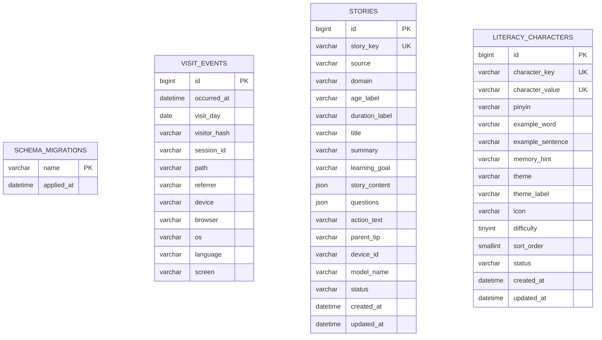

# 童趣成长乐园数据库表结构

## 文档用途

本文档是项目的数据库字典，记录所有 MySQL 表、字段、索引、表关系和数据生命周期。当前数据库基于 MySQL 8.0，使用 `mysql2` 和原生 SQL 迁移，不使用 ORM。

- 数据库名：本地默认 `playmori`，正式环境由 `.env` 决定
- 字符集：`utf8mb4`
- 排序规则：`utf8mb4_unicode_ci`
- 存储引擎：InnoDB
- 时间标准：所有 `DATETIME` 按 UTC 写入和读取
- 结构事实来源：`database/migrations/` 和 `server/db/migrate.mjs`
- 文档最后核对：2026-07-17

> 数据库迁移是可执行的事实来源，本文档是供开发和评审使用的结构说明。新增或修改表结构时，迁移文件和本文档必须在同一次提交中更新。

## 表清单

| 表名 | 类型 | 用途 | 主要数据来源 | 保留规则 |
| --- | --- | --- | --- | --- |
| `schema_migrations` | 系统表 | 记录已经执行过的 SQL 迁移，避免重复执行 | `npm run db:migrate` | 永久保留 |
| `visit_events` | 业务表 | 保存成人访客明确同意后的去标识化访问事件 | `/api/analytics/visit` | 默认保留 30 天 |
| `stories` | 业务表 | 统一保存系统预设故事和 AI 生成故事 | 预设故事同步、`/api/stories/generate` | 预设故事永久保留；AI 故事由当前设备主动删除 |
| `literacy_characters` | 业务表 | 保存汉字小森林的识字内容 | 识字内容同步 | 永久保留 |

## 当前表关系

当前四张表之间没有外键关系：

- `schema_migrations` 只管理数据库结构版本，不参与业务查询。
- `schema_migrations.name` 在逻辑上对应 `database/migrations/` 中的迁移文件名，但这不是数据库外键。
- `visit_events` 当前是独立事件表，不关联儿童、家长、账号或故事数据。
- `stories.device_id` 是浏览器生成的随机设备标识，用于找回和删除当前设备生成的 AI 故事；它不是用户表外键，也不代表儿童身份。
- `literacy_characters` 是独立的识字内容表；“我认识了”学习进度保存在浏览器，不关联数据库用户或儿童档案。

## `schema_migrations`

### 用途

记录迁移文件是否已经执行。该表由 `server/db/migrate.mjs` 自动创建和维护，不应由业务代码写入。

### 字段

| 字段名 | 类型 | 可空 | 默认值 | 键/索引 | 描述 |
| --- | --- | --- | --- | --- | --- |
| `name` | `VARCHAR(191)` | 否 | 无 | 主键 | 已执行的迁移文件名，例如 `001_create_visit_events.sql` |
| `applied_at` | `DATETIME(3)` | 否 | `CURRENT_TIMESTAMP(3)` | 无 | 迁移成功记录的时间，精确到毫秒 |

### 约束与关系

- 主键：`name`
- 外键：无
- 业务表关系：无
- 代码入口：`server/db/migrate.mjs`

## `visit_events`

### 用途

保存经过访客同意、服务端去标识化后的页面访问事件，用于统计访问量、热门页面和设备适配情况。不用于广告、儿童画像或跨日追踪个人。

### 字段

| 字段名 | 类型 | 可空 | 默认值 | 键/索引 | 描述 |
| --- | --- | --- | --- | --- | --- |
| `id` | `BIGINT UNSIGNED` | 否 | 自增 | 主键 | 访问事件唯一编号 |
| `occurred_at` | `DATETIME(3)` | 否 | 无 | `idx_visit_events_occurred_at`、`idx_visit_events_path_time` | 事件发生时间，按 UTC 保存，精确到毫秒 |
| `visit_day` | `DATE` | 否 | 无 | `idx_visit_events_visitor_day` | UTC 日期，用于生成和查询每日访客标识 |
| `visitor_hash` | `VARCHAR(20)` | 否 | 无 | `idx_visit_events_visitor_day` | 原始 IP 经服务端 HMAC-SHA256 处理后截取的每日标识；不保存原始 IP，每天都会变化 |
| `session_id` | `VARCHAR(64)` | 否 | 无 | 无 | 当前浏览器标签页生成的随机会话编号，不代表账号或儿童身份 |
| `path` | `VARCHAR(240)` | 否 | 无 | `idx_visit_events_path_time` | 访问页面路径；查询参数会被移除 |
| `referrer` | `VARCHAR(120)` | 否 | 无 | 无 | 来源网站域名；直接访问记录为 `direct`，不保存完整来源地址 |
| `device` | `VARCHAR(16)` | 否 | 无 | 无 | 设备大类：`desktop`、`tablet` 或 `mobile` |
| `browser` | `VARCHAR(20)` | 否 | 无 | 无 | 浏览器大类，如 `Chrome`、`Safari`、`Firefox`、`Edge` 或 `Other` |
| `os` | `VARCHAR(20)` | 否 | 无 | 无 | 操作系统大类，如 `iOS`、`Android`、`Windows`、`macOS`、`Linux` 或 `Other` |
| `language` | `VARCHAR(20)` | 否 | 无 | 无 | 浏览器语言，例如 `zh-CN` |
| `screen` | `VARCHAR(12)` | 否 | 无 | 无 | 屏幕宽度分组：`small`、`medium`、`large` 或 `unknown` |

### 索引

| 索引名 | 字段 | 用途 |
| --- | --- | --- |
| `PRIMARY` | `id` | 唯一定位访问事件 |
| `idx_visit_events_occurred_at` | `occurred_at` | 按时间范围生成报表和清理过期数据 |
| `idx_visit_events_path_time` | `path`, `occurred_at` | 查询某个页面在指定时间段内的访问情况 |
| `idx_visit_events_visitor_day` | `visitor_hash`, `visit_day` | 统计每日去重访客 |

### 约束、关系与生命周期

- 外键：无
- 当前业务表关系：无
- 写入入口：`server/analytics.mjs` → `server/database.mjs`
- 查询入口：`server/analytics-report.mjs`
- 清理入口：服务启动时调用 `deleteExpiredVisits`
- 保留期限：由 `ANALYTICS_RETENTION_DAYS` 控制，默认 30 天
- 降级机制：MySQL 写入失败时写入服务器本地 JSONL，数据库恢复后不影响网站访问

## `stories`

### 用途

统一保存系统预设故事和 AI 生成故事。两类故事共用相同的故事包结构，通过 `source` 区分：

- `fixed`：系统预设故事，当前五大领域各 5 篇，共 25 篇。
- `ai`：家长通过 DeepSeek 生成的个性故事。

### 字段

| 字段名 | 类型 | 可空 | 默认值 | 键/索引 | 描述 |
| --- | --- | --- | --- | --- | --- |
| `id` | `BIGINT UNSIGNED` | 否 | 自增 | 主键 | 数据库内部故事编号 |
| `story_key` | `VARCHAR(64)` | 否 | 无 | 唯一索引 `uk_stories_story_key` | 面向应用的稳定故事标识；预设故事使用可读标识，AI 故事使用 `ai-<UUID>` |
| `source` | `VARCHAR(16)` | 否 | 无 | `idx_stories_source_domain_status` | 故事来源：`fixed` 或 `ai` |
| `domain` | `VARCHAR(16)` | 否 | 无 | `idx_stories_source_domain_status` | 成长领域：`health`、`language`、`social`、`science` 或 `art` |
| `age_label` | `VARCHAR(20)` | 否 | 无 | 无 | 展示用年龄段，例如 `3～6岁`、`4～5岁` |
| `duration_label` | `VARCHAR(20)` | 否 | 无 | 无 | 展示用朗读时长，例如 `4分钟`、`约5分钟` |
| `title` | `VARCHAR(80)` | 否 | 无 | 无 | 故事标题 |
| `summary` | `VARCHAR(255)` | 否 | 无 | 无 | 故事简介 |
| `learning_goal` | `VARCHAR(255)` | 否 | 无 | 无 | 给成人看的单一成长目标 |
| `story_content` | `JSON` | 否 | 无 | 无 | 正文段落字符串数组 |
| `questions` | `JSON` | 否 | 无 | 无 | 两个亲子讨论问题组成的字符串数组 |
| `action_text` | `VARCHAR(500)` | 否 | 无 | 无 | 可以在现实生活中实践的小行动 |
| `parent_tip` | `VARCHAR(500)` | 否 | 无 | 无 | 给成人的引导提示 |
| `device_id` | `VARCHAR(64)` | 是 | `NULL` | `idx_stories_device_created` | 浏览器随机设备标识；预设故事为空，AI 故事用于当前设备历史查询和删除 |
| `model_name` | `VARCHAR(80)` | 是 | `NULL` | 无 | AI 故事使用的模型名；预设故事为空 |
| `status` | `VARCHAR(16)` | 否 | `active` | `idx_stories_source_domain_status` | 内容状态，当前使用 `active` |
| `created_at` | `DATETIME(3)` | 否 | `CURRENT_TIMESTAMP(3)` | `idx_stories_device_created` | 创建时间，按 UTC 保存 |
| `updated_at` | `DATETIME(3)` | 否 | 创建时为当前时间，更新时自动刷新 | 无 | 最近更新时间，按 UTC 保存 |

### 索引

| 索引名 | 字段 | 用途 |
| --- | --- | --- |
| `PRIMARY` | `id` | 唯一定位数据库记录 |
| `uk_stories_story_key` | `story_key` | 防止同一故事重复写入，并保持前端收藏标识稳定 |
| `idx_stories_source_domain_status` | `source`, `domain`, `status` | 按来源、成长领域和状态读取故事书架 |
| `idx_stories_device_created` | `device_id`, `created_at` | 按当前设备读取最近生成的 AI 故事 |

### 数据来源、关系与生命周期

- 预设故事源文件：`database/fixed-stories.mjs`。
- 预设故事同步：`npm run db:migrate` 会在结构迁移后执行 `server/db/seed-stories.mjs`，使用 `story_key` 幂等新增或更新 25 篇故事。
- 预设故事读取：`GET /api/stories/fixed`。
- AI 故事写入：`POST /api/stories/generate` 在 DeepSeek 返回完整故事后写入数据库，写入成功后才向前端返回。
- AI 历史读取：`GET /api/stories/history`，设备编号通过 `X-Device-ID` 请求头传递，避免出现在访问日志 URL 中。
- AI 历史删除：`DELETE /api/stories/history`，同样使用 `X-Device-ID`，执行硬删除。
- 家长填写的原始事件、小名、偏好和氛围不写入 `stories`；生成结果本身可能包含家长要求使用的小名。
- 预设故事永久保留；AI 故事目前保留到当前设备主动清空为止。
- 外键：无。`device_id` 是随机标识，不关联用户、儿童或访客统计表。

## `literacy_characters`

### 用途

保存汉字小森林的系统识字内容。首版包含自然、动物、身体、家人和大小方向五个主题，每个主题 6 个字，共 30 个汉字。

### 字段

| 字段名 | 类型 | 可空 | 默认值 | 键/索引 | 描述 |
| --- | --- | --- | --- | --- | --- |
| `id` | `BIGINT UNSIGNED` | 否 | 自增 | 主键 | 数据库内部识字内容编号 |
| `character_key` | `VARCHAR(64)` | 否 | 无 | 唯一索引 `uk_literacy_characters_key` | 内容稳定标识，例如 `nature-sun` |
| `character_value` | `VARCHAR(8)` | 否 | 无 | 唯一索引 `uk_literacy_characters_value` | 要学习的汉字，首版均为单字 |
| `pinyin` | `VARCHAR(32)` | 否 | 无 | 无 | 带声调拼音，例如 `rì` |
| `example_word` | `VARCHAR(40)` | 否 | 无 | 无 | 与汉字相关的常见词语 |
| `example_sentence` | `VARCHAR(160)` | 否 | 无 | 无 | 适合 3～6 岁儿童理解的短句 |
| `memory_hint` | `VARCHAR(160)` | 否 | 无 | 无 | 观察字形或动作的联想提示 |
| `theme` | `VARCHAR(24)` | 否 | 无 | `idx_literacy_characters_theme_status_sort` | 主题代码：`nature`、`animals`、`body`、`family` 或 `space` |
| `theme_label` | `VARCHAR(32)` | 否 | 无 | 无 | 主题展示名称 |
| `icon` | `VARCHAR(16)` | 否 | 无 | 无 | 帮助建立生活联想的 Emoji 图形 |
| `difficulty` | `TINYINT UNSIGNED` | 否 | `1` | 无 | 内容难度，首版使用 1～2 |
| `sort_order` | `SMALLINT UNSIGNED` | 否 | 无 | `idx_literacy_characters_theme_status_sort` | 全局展示和同步顺序 |
| `status` | `VARCHAR(16)` | 否 | `active` | `idx_literacy_characters_theme_status_sort` | 内容状态，当前使用 `active` |
| `created_at` | `DATETIME(3)` | 否 | `CURRENT_TIMESTAMP(3)` | 无 | 创建时间，按 UTC 保存 |
| `updated_at` | `DATETIME(3)` | 否 | 创建时为当前时间，更新时自动刷新 | 无 | 最近更新时间，按 UTC 保存 |

### 索引

| 索引名 | 字段 | 用途 |
| --- | --- | --- |
| `PRIMARY` | `id` | 唯一定位数据库记录 |
| `uk_literacy_characters_key` | `character_key` | 保持内容标识稳定并支持幂等同步 |
| `uk_literacy_characters_value` | `character_value` | 防止首版同一个汉字重复出现 |
| `idx_literacy_characters_theme_status_sort` | `theme`, `status`, `sort_order` | 按主题和顺序读取有效识字内容 |

### 数据来源、关系与生命周期

- 内容源文件：`database/literacy-characters.mjs`。
- 内容同步：`npm run db:migrate` 或 `npm run db:seed` 执行 `server/db/seed-literacy.mjs`，幂等同步 30 个汉字。
- 内容读取：`GET /api/literacy/characters`。
- 当前设备学习进度：只保存在浏览器 `localStorage`，不写入数据库。
- 保留期限：系统识字内容永久保留；下线内容可通过 `status` 管理。
- 外键：无。

## 表结构维护规范

以后增加或修改任何表结构，都必须同时完成以下事项：

1. 在 `database/migrations/` 新增按顺序编号的 SQL 文件，例如 `004_create_story_favorites.sql`；已经执行过的迁移文件不得直接修改。
2. 在本文档的“表清单”中增加或更新对应表。
3. 补齐字段、主键、唯一约束、普通索引、外键、数据来源和保留规则。
4. 更新 Mermaid 关系图；有关联时明确标注一对一、一对多或多对多。
5. 如果使用外键，关联字段统一使用 `<实体>_id`，字段类型必须与被引用主键完全一致，并为关联字段建立索引。
6. 表名和字段名使用小写 `snake_case`；业务表优先使用复数表名。
7. 自增主键默认使用 `BIGINT UNSIGNED`；时间字段使用 `DATETIME(3)` 并按 UTC 处理。
8. 明确数据是否包含个人信息、保留多久、如何删除，不得在数据库或文档中保存密钥和明文密码。
9. 执行 `npm run db:migrate`、`npm run db:check` 和 `npm test`，确认成功后再提交。
10. 同步更新个人知识库中的 `儿童成长乐园/02-技术/数据库表结构.md`。

## 变更记录

| 日期 | 迁移 | 变更 |
| --- | --- | --- |
| 2026-07-16 | 迁移脚本自动创建 | 新增 `schema_migrations` 迁移记录表 |
| 2026-07-16 | `001_create_visit_events.sql` | 新增 `visit_events` 去标识化访客事件表及三个查询索引 |
| 2026-07-17 | `002_create_stories.sql` | 新增统一 `stories` 表，支持预设故事和 AI 故事、设备历史查询及删除 |
| 2026-07-17 | `003_create_literacy_characters.sql` | 新增 `literacy_characters`，保存五个主题共 30 个识字内容 |
